# Projeto: Aumento da prevalência de perda auditiva e a exposição ao ruído: há relação?
# Project: Increased prevalence of hearing loss and exposure to noise: is there a relationship?

# Apresentação

O presente projeto foi originado no contexto das atividades da disciplina de pós-graduação [*Ciência e Visualização de Dados em Saúde*](https://github.com/datasci4health/home), oferecida no primeiro semestre de 2021, na Unicamp.

|Nome                     | RA      | Especialização         |
|-------------------------|---------|------------------------|
| José Claudio Klier      | 190953  | Saúde                  |
| Júlia Ferreira Tessler  | 119655  | Computação             |
| Laura Chiriboga         | 207391  | Saúde - Fonoaudiologia |
| Yuliana Apaza           | 234986  | Computação             |

# Descrição Resumida do Projeto

Diante do relatório mundial da audição publicado em março de 2021, observou-se que há uma projeção para que em 2050, 2,5 bilhões de pessoas irão conviver com algum grau de perda auditiva e a prevalência da deficiência auditiva aumenta a cada ano. Sabe-se que, mesmo um grau leve de perda da audição, traz consequências negativas para a vida do indivíduo, tais quais dificuldades de interação social,  perda de oportunidades, isolamento, depressão e aumenta em até 8% a chance de desenvolver demência. Esses impactos negativos podem ser evitadas e/ou minimizados quando há uma compreensão do cenário geral e entendimento de políticas que podem ser realizadas tantos em termos de prevenção e promoção de saúde como em processos de reabilitação da audição. 

Desta forma, um serviço de saúde auditiva centrada no indivíduo através de um sistema de saúde fortalecido sistema pode superar os desafios enfrentados. E, uma das propostas presentes é o direcionamento das políticas para a redução do ruído, ou seja, de toda poluição sonora que vivemos hoje. 

Portanto, o intuito desta pesquisa foi encontrar as reais relações presentes entre a perda auditiva (e o aumento da sua prevalência a cada ano) com o ruído, visto que este também está aumentando a cada ano.  Avaliou-se dados demográficos e de audiometria da NHANES de anos sequenciais e ajustamos modelos de classificação com o objetivo de encontrar formas de predizer a perda auditiva baseado nas informações demográficas e de questionários fornecidas. Os modelos treinados não apresentaram resultados bons por conta do desbalanço entre as classes dos dados, mas a análise exploratória foi capaz de encontrar relações que corroboram a hipótese de que há maior prevalência de perda auditiva para as pessoas que são mais expostas ao ruído não laboral.

No entanto, sabe-se que a etiologia da perda auditiva pode apresentar diversos fatores e não é possível, com os dados que temos, isolar todas as variáveis. Deste modo, há uma relação entre os indivíduos que tem perda com a exposição a ruído, mas não se pode afirmar que a causa da perda auditiva foi exclusivamente este ruído.

# Vídeos do Projeto

## Vídeo da Proposta

[Aqui](https://youtu.be/Usq-nvxmtDM) encontra-se o vídeo de apresentação da proposta do projeto.

## Vídeo da Apresentação Final

[Aqui](https://youtu.be/Usq-nvxmtDM) encontra-se o vídeo de apresentação final do projeto.

# Slides do Projeto

## Slides da Proposta

[Aqui](https://drive.google.com/file/d/1nxkBIBAIzbgwBHKyyydw2xT_nSwXvdha/view?usp=sharing) encontram-se os slides da apresentação da proposta.

## Slides da Apresentação Final

[Aqui](https://drive.google.com/file/d/11g4k5vnpn1xuPhWg4o2nC7PBPy-CaVJD/view?usp=sharing) encontram-se os slides da apresentação final.

# Introdução e Referenciais Teóricos

De acordo com projeções realizadas pela Organização Mundial da Saúde (OMS), até 2050, uma em cada dez pessoas terão perda auditiva (PA) incapacitante (1). Portanto, sabe-se que a PA é e será um tema cada vez mais discutido e presente no cenário mundial, pois independentemente da idade, provoca consequências negativas na comunicação, no estado emocional, na educação e na qualidade de vida (2). Além disso, é estimado que US $ 1 trilhão é perdido a cada ano devido à nossa falha coletiva em abordar adequadamente este problema, se tornando um encargo financeiro enorme(3).

Observou-se uma grande movimentação de entidades importantes de saúde para alertar a respeito da perda auditiva e seus impactos. No contexto em que a perda auditiva muitas vezes ainda é referida como uma "deficiência invisível", não apenas por causa da falta de sintomas visíveis, mas porque há muito tempo é estigmatizado nas comunidades e ignorado pelos formuladores de políticas.

Em 3 de março de 2021 tivemos a publicação do primeiro Relatório Mundial da Audição (3), em que foram elencados diversos fatores sobre a perda auditiva, como:  a importância da audição durante a vida, soluções possíveis em casos de perdas auditivas, desafios encarados frente aos cuidados da orelha e da audição e um possível caminho futuro para a saúde pública auditiva. 
Muitas causas de perda auditiva podem ser evitadas. Doenças de ouvido comuns, infecções de ouvido, doenças evitáveis ​​por vacinas e exposição a ruído e produtos químicos colocam em perigo o ouvir falar de muitas pessoas em diferentes idades. A Organização Mundial da Saúde (OMS) estima, por exemplo, que mais de 1 bilhão de jovens se colocam em risco de perda permanente de audição, muitas vezes sem saber, ao ouvir música em alto volume intensidade durante longos períodos de tempo. Mitigar esses riscos por meio de ações de saúde pública é essencial para tratar a perda auditiva.
O relatório mostra que medidas de saúde pública baseadas em evidências e econômicas podem prevenir muitas causas de perda auditiva. Segundo os autores, “Prevenir e tratar doenças e deficiências de todos os tipos não é um custo, mas um investimento em um mundo mais seguro, justo e próspero para todas as pessoas”. 

Desta forma, o intuito desta pesquisa é entender como funciona a prevalência da perda auditiva e suas relações com a exposição ao ruído não laboral. Avaliou-se dados demográficos e de audiometria da [NHANES](https://wwwn.cdc.gov/nchs/nhanes/Default.aspx) de múltiplos anos e ajustamos modelos de classificação com o objetivo de encontrar formas de prever o nível de perda auditiva baseado nas informações demográficas fornecidas. Os modelos treinados não apresentaram resultados bons por conta do desbalanço entre as classes dos dados, mas a análise exploratória foi capaz de encontrar relações que corroboram a hipótese de que há maior prevalência de perda auditiva para as pessoas que são expostas ao ruído não laboral.

# Perguntas de Pesquisa

**PERGUNTA NORTEADORA: Qual a relação da perda auditiva com a exposição ao ruído não laboral?** 

Além desta pergunta, levantou-se outras derivadas da inicial: é possível prever a perda auditiva de acordo com dados demográficos obtidos? a prevalência da perda auditiva está aumentando e, junto a isso, a poluição sonora e o tempo de uso de fones de ouvido também. Desta forma, existe alguma associação entre elas? Como se dão? Há uma população mais afetada pelo ruído não laboral?

# Metodologia

Este estudo é definido como estudo observacional descritivo. 

A seleção do tema se deu por meio da discussão do grupo perante as áreas de atuação dos profissionais da saúde que o compunham. Dentro os temas levantados, a saúde auditiva e mais propriamente a perda auditiva foi o escolhido.

Baseados nesta temática, o grupo levantou uma pergunta norteadora baseada no anagrama PICOT, descrita a seguir: Qual a relação da perda auditiva com a exposição ao ruído não laboral? Como citado acima, também levantou-se perguntas derivadas de interesse, com a intenção de serem respondidas por meio da ciência dos dados. Desta forma, o grupo se direcionou para buscar bases de dados condizentes para a pesquisa. As bases de dados estão referenciadas na seção seguinte.

A análise dos dados se baseou no processo de extração de conhecimento por meio de dados KDD - Knowledge Discovery in Databases, desenvolvida por Fayyad et. al.(1996), com intuito de visualizar insights de relações de interesse que não haviam sido previamente elencadas,  como também auxiliar na validação de conhecimento extraído. Segue abaixo o fluxograma do processo KDD (6,7).

# Bases de Dados e Evolução

Em pesquisa inicial sobre o tema, encontrou-se bancos de dados disponíveis a respeito de saúde que incluem informações relacionadas à perda auditiva, dentre outras, o que permite estudos e modelagem de fatores a fim de responder às perguntas levantadas. São eles:

| Fontes de dados | Resumo descritivo |
|-----------------|-------------------|
| [National Health and Nutrition Examination Survey (NHANES)](https://wwwn.cdc.gov/nchs/nhanes/Default.aspx) | NHANES avalia a saúde e o estado nutricional de adultos e crianças nos Estados Unidos. NHANES inclui questões demográficas, socioeconômicas, dietéticas e relacionadas à saúde.Possui exames de audiometria dos indivíduos, além de dados de pressão arterial, dados dietéticos, dados laboratoriais, etc. (6, 7) |
| [Base de Dados dos Direitos da Pessoa com Deficiência](http://basededados.sedpcd.sp.gov.br/index.php) | Dados censitários e informações sobre a pessoa com deficiência nas áreas de educação, saúde, emprego e renda desenvolvimento entre outras. |
| [Global Burden of Disease Study 2017 / 2019](http://ghdx.healthdata.org/gbd-2019) | *Framework* para integrar, validar, analisar e disseminar informações para avaliar a importância comparativa das doenças, lesões e fatores de risco em causar morte prematura, perda de saúde e incapacidade em diferentes populações. |

Baseados na etapa de seleção do KDD, iniciamos uma exploração superficial nestas bases.

Visto que a base do NHANES possuia inúmeras informações relevantes para o nosso trabalho, optou-se por focar somente nela e aproveitar os dados nela disponíveis. 

## Base de dados estruturada e adotada

Desta forma, a base estudada e adotada foi: 

| **Fonte de dados** | **Endereço na web** | **Resumo descritivo** | 
|--------------------|---------------------|------------------------|
| National Health and Nutrition Examination Survey (NHANES) | https://wwwn.cdc.gov/nchs/nhanes/Default.aspx | NHANES avalia a saúde e o estado nutricional de adultos e crianças nos Estados Unidos. NHANES inclui questões demográficas, socioeconômicas, dietéticas e relacionadas à saúde. Possui exames de audiometria dos indivíduos, além de dados de pressão arterial, dados dietéticos, dados laboratoriais, etc. (6,7)|

Dentro desta base, foi possível visualizar dados demográficos, dados de dieta, dados de exames, dados de exames laboratoriais e dados de questionários aplicados dos períodos de 1999 a 2020.  Visto que o objetivo do trabalho era relacionar a perda auditiva com a exposição ao ruído, optou-se por selecionar 5 períodos (2005-2006; 2007-2008; 2009-2010; 2011-2012; 2015-2016), por apresentarem informações mais consistentes perante ao tema. Isso porque alguns anos não apresentavam as informações completas ou mesmo nem existiam (exemplo do ano de 2019-2020, em que ainda não existem os dados de exame de audiometria). 

Antes de iniciarmos qualquer exploração dos dados, foi muito relevante lermos os guias disponibilizados pela base de dados de cada período que selecionamos, que contava com: Examination Variable List, Procedure Manuals, Examination Data Overview e SAS UniversalViewer. Nestes documentos encontramos informações a respeito da coleta dos exames e das respostas ao questionário e de que forma estes dados foram organizados e apresentados.  Segue ilustração de exemplo do manual de procedimentos da audiometria.

Fonte: https://wwwn.cdc.gov/nchs/data/nhanes/2015-2016/manuals/2016_Audiometry_Procedures_Manual.pdf

As variáveis disponíveis foram avaliadas individualmente perante sua relevância técnica para o desenvolvimento das análises, e concluiu-se que seriam utilizados os dados de exame, dados de questionário e dados demográficos. Os dados de exame proveram a avaliação audiológica, os de questionário envolviam respostas referentes à exposição a ruído não laboral, e os demográficos as condições gerais da população estudada.

Os dados foram apresentados nas planilhas por meio de códigos, e para possibilitar a priorização dos que nos eram importantes, utilizamos o dicionário fornecido pelo próprio NHANES e presente em sua base de dados.
Exemplo: AUXOTSPL referia-se a Normal: Left Ear Otoscopy.

Cada tabela da NHANES vem como um arquivo XPT (SAS), sendo SEQN a chave única responsável por conectar as respostas de cada indivíduos nas diferentes tabelas. Em especial, focamos nas tabelas DEMO (dados demográficos), AUQ (dados de audiometria), AUX (dados de audiometria), AUXAR (dados de reflexo acústico de audiometrias) e AUXTYM (dados de timpanometria) de cada ano de pesquisa.

# Análise exploratória

Visto que o grupo escolheu usarmos somente uma base de dados para o estudo, já que a NHANES apresenta inúmeros dados pertinentes ao tema escolhido, iniciou-se gerando uma única tabela com os dados de interesse para cada ano escolhido, resultando posteriormente em um material com os dados de todos os anos que iriamos estudar.

Após verificar todo o dicionário (dos subitens dados de exames e dados de questionário), foram selecionados quais seriam os códigos de variáveis referentes a dados adequados à pesquisa. Estes códigos foram organizados de tal forma a iniciar a análise exploratória destes dados.

Foram observados padrões de apresentações no dicionário, visto que os códigos que se iniciavam com A se referiam a audiometria, tanto nos dados de exame como nos dados do questionário.

No entanto, determinadas informações eram divergentes visto que, no decorrer dos anos, algumas perguntas foram modificadas, adicionadas ou removidas do questionário. No caso de modificações referentes a formatos, optou-se por utilizar valores em uma mesma medida (por exemplo, datas com valores em meses e anos, optou-se por se utilizar os valores em anos).

A definição de alguns códigos foi reescrita de forma individual com objetivo de padronizar os parâmetros para comparação (por exemplo a alteração de “INDFMPIR: family PIR” para “INDFMPIR: Ratio of family income to poverty”, uma vez que equivalem ao mesmo código). Possibilitando assim que todos os códigos presentes em todos os anos se referissem ao mesmo parâmetro de análise.

Outro aspecto relevante a ser relatado foi o exame de timpanometria (exame que faz parte da avaliação auditiva), que no último ano selecionado para análise apresentou um padrão de respostas diferente do que havia nos outros anos.

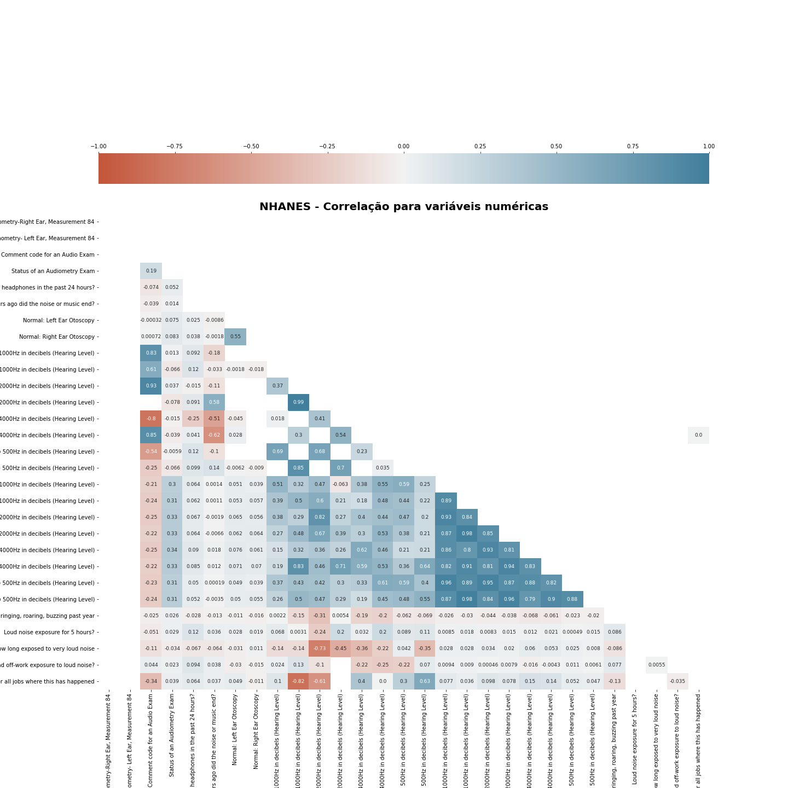

O mapa de calor de correlação traz referências visuais para variáveis com maior correlação linear (de Pearson). Aqui, nota-se altos valores de correlação para as medidas de de teste de audiometria. Há também uma correlação espúria para quantidade de meses em trabalhos com longa exposição a ruídos e o reteste da audiometria na orelha direita para 1000Hz, por exemplo.

De acordo com critérios audiológicos, seguimos passos para reduzirmos possíveis vieses na análise dos dados, para direcionarmos a alterações auditivas que provavelmente estariam associadas à exposição ao ruído (como por exemplo, somente selecionar indivíudos com a otoscopia considerada normal. Nota: otoscopia é o exame que analisa as condições do meato acústico interno e membrana timpânica). 

| **Ano**     | **Orelha Esquerda: Otoscopia Normal** | **Percentual de Normais** |
|-------------|---------------------------------------|---------------------------|
| 2005 - 2006 |                                  2299 |                    82,43% |
| 2007 - 2008 |                                   999 |                    86,95% |
| 2009 - 2010 |                                  1729 |                    77,57% |
| 2011 - 2012 |                                  3328 |                    85,16% |
| 2015 - 2016 |                                  3561 |                    83,14% |

| **Ano**     | **Orelha Direita: Otoscopia Normal** | **Percentual de Normais** |
|-------------|--------------------------------------|---------------------------|
| 2005 - 2006 |                                 2345 |                    84,08% |
| 2007 - 2008 |                                 1004 |                    87,38% |
| 2009 - 2010 |                                 1774 |                    79,59% |
| 2011 - 2012 |                                 3372 |                    86,28% |
| 2015 - 2016 |                                 3631 |                    84,78% |

Outro aspecto importante na analise destes dados foi: alguns indivíduos foram submetidos ao reteste e outros não. Isso aconteceu por conta de um fenômeno que ocorre na audição chamado de audição cruzada. Quando percebeu-se a presença disto, ou seja, a influência de uma orelha na resposta da outra orelha, os limiares auditivos destes inidivíudos foram retestados com outro tipo de fone de ouvido para a testagem (no intuito de reduzir esta interferência). Para tanto, em nossa análise, foram utilizados os dados de teste para os indivíudos que não necessitaram de reteste e os dados de reteste para aqueles que necessitaram. Ou seja, foram também realizados filtros nos dados existentes para este direcionamento.

Durante o processo de pré procesamento dos dados, foram elencados passos a serem seguidos para, em primeiro lugar, determinar, para cada sujeito, se havia ou não uma perda auditiva (e, se houvesse, qual o seu grau). Para isso foi aplicado o cálculo de classificação de grau de perda auditiva da Organização Mundial de Saúde, onde se determinam as médias entre as frequências de 500Hz, 1kHz, 2kHz e 4kHz, por orelha. O grau de perda é definido segundo o quadro abaixo, referente à classificação de grau de perda auditiva (Organização Mundial da Saúde, 2020) (1).

Isso é necessário para conseguirmos posteriormente fazer as relações com os dados demográficos e com as respostas ao questionário sobre a exposição ao ruído e buscar identificar quais são as possíveis associações.

Neste momento de análise, filtramos os dados para apenas pessoas com otoscopia normal, totalizando 11.916 indivíduos para a orelha esquerda e 12.126 para a orelha direita.

Dentro de todo material de dados, não foram verificados dados faltantes. Desta forma, nesta etapa de análise, não foi preciso utilizar nenhuma estratégia futura para os missing datas.Isto porque já havia sido feita uma análise prévia e sido selecionado os períodos que possuíam os dados que nós necessitávamos.

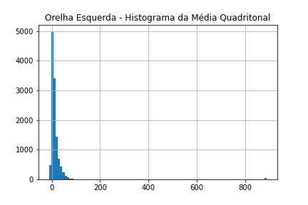

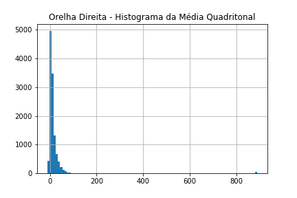

As médias quadritonais para ambas as orelhas seguem distribuição muito próxima (e, de fato, ambas possuem mesma mediana, 8,75) e bastante assimétrica.

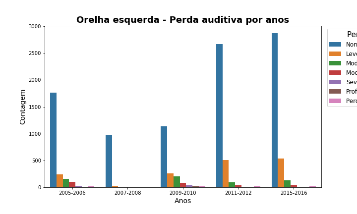

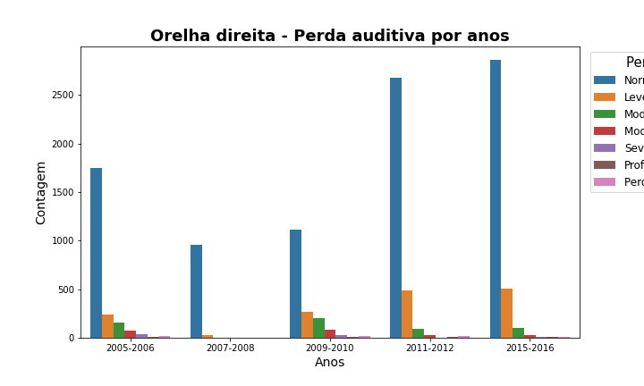

As visualizações da classificação de perda auditiva por anos são interessantes para ver a magnitude da proporção de medidas de cada tipo, mas torna a comparação através dos anos muito difícil.

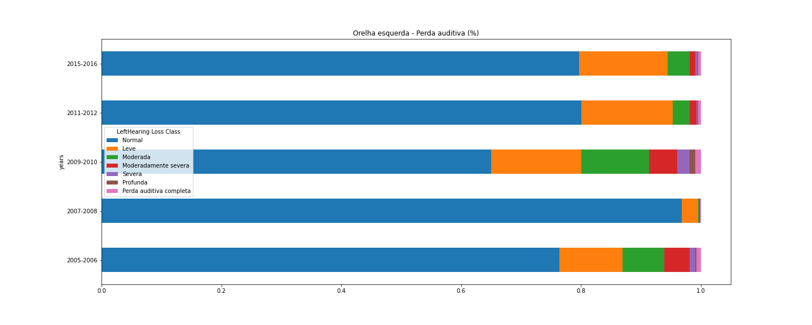

Por outro lado, a avaliação acumulada e normalizada em percentuais (a barra de cada ano equivale a 100% dos valores daquele ano) não entrega indícios claros de que há diferença da classificação de perda em relação aos anos, o que refutaria a nossa hipotese de que houve aumento da prevalência de perda auditiva.

## Análises realizadas - Integração entre dados de audiometria, questionário e demográficos

A integração foi feita entre os dados de exame de audiometria, dados de questionário e dados demográficos. Os níveis calculados de perda auditiva foram plotados com as demais variáveis, e não foi possível observar no decorrer dos anos um padrão de repetição na correlação negativa entre os níveis de ruído e a capacidade auditiva (ou seja, diminuição da capacidade auditiva relacionada ao aumento dos níveis de ruído). Tais resultados levam a acreditar que não houve aumento de perda auditiva neste período, entretanto vale ressaltar que os níveis amostrais se encontravam desiguais, dificultando a conclusão.

Posteriormente uma análise considerando a relação entre os dados demográficos e a perda auditiva foi realizada, utilizando os exames já classificados em grau de perda auditiva.

### Modelagem

Treinamos modelos de classificação supervisionados em uma tentativa de entender se é possível prever os resultados do exame de audiometria através de outros dados. A primeira dificuldade nessa etapa foi a natureza esparsa dos dados, o que gerou muitos dados faltantes que são empecilhos para estes modelos. Optou-se por eliminar as colunas com maior quantidade de dados faltantes e, das que restaram, eliminamos as linhas com dados faltantes. Por fim, ficamos com as seguintes colunas:

* Have you been exposed to loud noise or listened to music with headphones in the past 24 hours? (Você foi exposto a sons altos ou escutou música com fones de ouvido nas últimas 24h?)
* Ears ringing, roaring, buzzing past year (Zunido nos ouvidos no último ano)                                
* Gender (Gênero)                                   
* Age in years at screening  (idade em anos na checagem)                                             
* Race/Hispanic origin  (Raça/origem hispânica)                                                                   
* Total number of people in the Household (Número total de pessoas na casa)                                   
* Total number of people in the Family (Número total de pessoas na família)                                         
* Annual family income (Renda familiar anual)                                                                  
* Ratio of family income to poverty (Razão da renda familiar para pobreza)                                              
* Country of birth  (País de nascimento)                                                                           
* Annual household income (Renda domiciliar anual)

Para cada orelha, obtivemos a seguinte quantidade de observações de cada classe de perda auditiva:

| Orelha       | Classe                  | Quantidade |
|--------------|-------------------------|-----------:|
| **Esquerda** | Normal                  | 6997       |
|              | Leve                    | 1209       |
|              | Moderada                | 394        |
|              | Moderadamente severa    | 138        |
|              | Severa                  | 54         |
|              | Perda auditiva completa | 41         |
|              | Profunda                | 22         |
| **Direita**  | Normal                  | 6982       |
|              | Leve                    | 1164       |
|              | Moderada                | 366        |
|              | Moderadamente severa    | 126        |
|              | Perda auditiva completa | 41         |
|              | Severa                  | 35         |
|              | Profunda                | 14         |

Totalizando 8855 linhas para a orelha esquerda e 8728 linhas para a orelha direita. Outras estratégias de trabalho com dados desbalanceados como o _upsampling_ (substituir os valores faltantes por outros estimados) ou _undersampling_ (reamostrar as classes dominantes de forma a chegar a tamanho semelhante das menores) distorceriam muito os dados. No caso da primeira, não teríamos muita confiança para as classes com menos dados e, na segunda, restariam poucos dados em comparação com o todo.

Observou-se que, com as classes desbalanceadas, os modelos performaram mal, mesmo com a escolha de estruturas de árvore, que supostamente são mais flexíveis a esse tipo de situação naturalmente. Também deixamos de usar a acurácia como métrica de comparação entre os modelos e usamos o F1 Score.

Além de modelos de árvore (que permitem visualização gráfica das relações entre variáveis), também treinamos um modelo SVC (que se assemelha a um SVM, mas se ajusta melhor a dados desbalanceados) e a regressão logística, cujos coeficientes angulares trariam medidas interessantes de relevância das variáveis para a predição das classes. Dividimos o conjunto de dados em treino, teste e validação aleatóriamente, sendo a divisão de 80%, 10% e 10%, respectivamente. O resultado do F1 score para cada ajuste foi:

| Modelo                   | Orelha    |  F1 Score |
|--------------------------|-----------|-----------|
| Decision Tree Classifier | Esquerda  |    72,67% |
| Random Forest            | Esquerda  |    75,68% |
| SVC                      | Esquerda  |    67,35% |
| Regressão Logística      | Esquerda  |    67,51% |
| Decision Tree Classifier | Direita   |    75,74% |
| Random Forest            | Direita   |    77,11% |
| SVC                      | Direita   |    67,56% |
| Regressão Logística      | Direita   |    67,38% |

Vislumbrando ter alguma luz sobre a pergunta principal do estudo, a qual relacionava a perda auditiva com a exposição ao ruído, utilizamos o questionário respondido pelos pacientes nas perguntas relacionadas a ruído não laboral, entre elas: “Ears ringing, roaring, buzzing past year”, “Loud noise exposure for 5 hours?”, “Ever had non-job exposure to loud noise?”, “How long exposed to very loud noise”, “Had off-work exposure to loud noise?”. A correlação entre estas variáveis indica que a correlação entre as variáveis de nível exposição a ruídos e demografia não são muito fortes, o que pode explicar o ajuste ruim dos modelos.

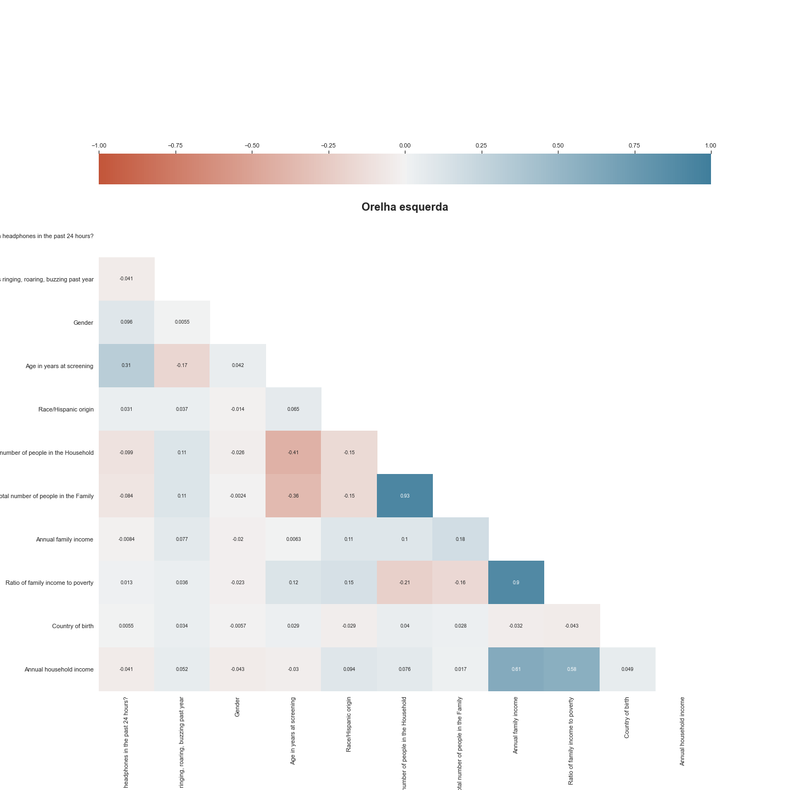

Observamos que referente a questão “Ears ringing, roaring, buzzing past year”,  a maioria das pessoas que têm audição normal respondeu que não teve zumbido e a % de pessoas que têm perda e falaram que tem zumbido é maior do que as pessoas que têm perda e falaram que não.  Para todas as imagens abaixo, 1 equivale à resposta sim e 2, não.

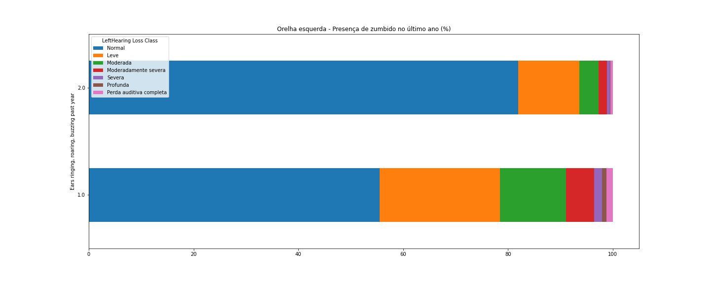

Na resposta para a questão “Had off-work exposure to loud noise?” , vemos que principalmente que pessoas com perdas leves relataram estar expostas a ruído em relação às com perda leve e não estavam.

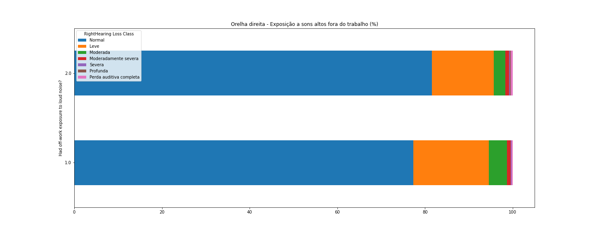

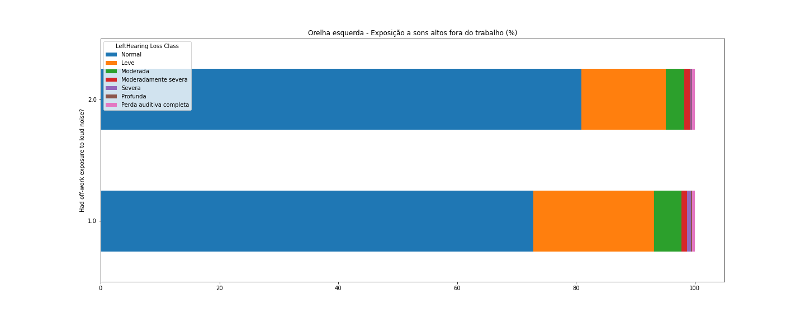

Para “How long exposed to very loud noise”, aqui parece que há uma tendência de até as 7 horas de exposição, conforme aumenta o tempo de exposição, aumenta o número de pessoas com perdas auditivas (exceto para 8 horas de exposição).

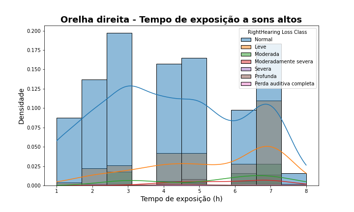

|Orelha  esquerda - Classificação de perda |Contagem|	Média	|Desvio padrão	|Mínimo	|25%	|50%	|75%	|Máximo|
|--------------|---|---|---|---|---|---|---|---|	
|Leve |	144.0	|5.91|	8.01|	1.0|	4.00|	6.0|	7.00|	99.0|
|Moderada|	43.0	|5.65	|1.69|	2.0	|4.50	|7.0|	7.00	|7.0|
|Moderadamente severa|	11.0|	6.91|	0.30	|6.0	|7.00|	7.0	|7.00	|7.0|
|Normal	|506.0|	4.27|	1.93	|1.0	|3.00	|4.0|	6.00	|8.0|
|Perda auditiva completa|	4.0|	4.5	|2.08|	2.0|	3.50	|4.5|	5.50|	7.0|
|Profunda	|2.0	|5.5|	0.71	|5.0|	5.25	|5.5	|5.75|	6.0|
|Severa |	1.0	| 7.0 |	NaN |	7.0 |	7.00 |	7.0 |	7.00	|7.0 |

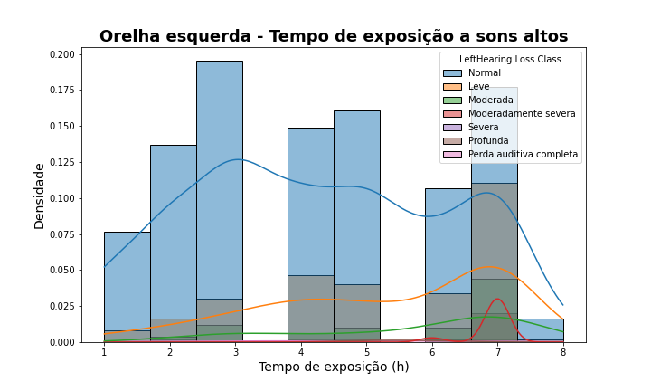

|Orelha  direita - Classificação de perda |Contagem|	Média	|Desvio padrão	|Mínimo	|25%	|50%	|75%	|Máximo|
|--------------|---|---|---|---|---|---|---|---|	
|Leve	|139.0|	5.96|	8.14	|1.0|	4.00|	6.0	|7.00|	99.0|
|Moderada	|34.0	|5.5|	1.67	|3.0	|3.25|	6.0|	7.00	|7.0|
|Moderadamente severa|	17.0	|5.82	|1.18|	4.0	|5.00	|6.0	|7.00	|7.0|
|Normal	|523.0	|4.23	|1.95|	1.0|	3.00	|4.0|	6.00|	8.0|
|Perda auditiva completa	|3.0	|4.67	|2.52	|2.0|	3.50	|5.0	|6.00	|7.0|
|Profunda	|2.0|	4.5	|0.71|	4.0	|4.25|	4.5	|4.75|	5.0|
|Severa	|1.0	|3.	|NaN|	3.0	|3.00	|3.0|	3.00	|3.0|

É importante realizar a ressalva que precisamos fazer é que os gráficos estão desta forma apresentando maior % de audição normal poruqe é esse resultado que temos no banco de dados (maior quantidade de pessoas que apresentaram audição normal).

Não é possível afirmar que as pessoas perderam a capacidade auditiva por causa da exposição de ruído. A perda auditiva tem inúmeras etiologias e até somatória de fatores e não conseguimos fazer uma análise específica e controlando todas as variáveis para garantir o resultado. 

Ao fazer um panorama geral do trabalho, as principais dificuldades observadas foram quanto à quantidade de dados faltantes e a maneira de coleta e “plotagem” deles, que diferiam de um ano para o outro. Isso dificultou a realização de determinadas análises e a possibilidade de criar modelos para responder a alguns de nossos questionamentos. 

É importante ressaltar que a todo momento foi necessário revisitar os dados, revisitar o dicionário da base de dados para que conseguíssimos elaborar ideias e soluções. O pipeline do KDD se tornou, muitas vezes, um ciclo, em que pre- processávamos os dados, tentávmos analisar, retornávamos para o pre processamento e assim sucessivamente. 

# Conclusão

A parte de dados demográficos, não é possível predizer se há ou não perda auditiva. No entando, por meio da relação das questões relacionada à exposição à ruído não laboral, há evidências - ainda que não fortes - de que há relação causal entre as duas variáveis: ou seja, maior exposição ao ruído não laboral leva à perda auditiva. É importante ressaltar que a perda auditiva tem inúmeras etiologias e até somatória de fatores, de forma que não foi possível fazer uma análise específica e controlando todas as variáveis para garantir que estão estão relacionadas ao ruído.

# Trabalhos futuros

A modelagem dos dados sofreu com o desequilíbrio entre as classes. Assim sendo, uma hipótese para melhoria desta etapa é tentar técnicas de equilíbrio das amostras - com as ressalvas mencionadas em relação a _upsampling_ e _undersampling_.

Outra possibilidade de análise seria utilizar alguma técnica de análise de causalidade para corroborar ou refutar as hipóteses de causa e efeito entre exposição a ruídos e perda auditiva.

# Ferramentas

**Nota:** mais ferramentas podem ser adicionadas ou excluídas ao longo da execução do projeto.

| **Ferramenta** | **Resumo descritivo** |
|----------------|-----------------------|
| Python 3.x.x   | Linguagem de programação |
| NumPy | Biblioteca do Python orientada a operação de vetores e matrizes multidimensionais |
| Pandas | Biblioteca do Python orientada a manipulação e análise de dados |
| Matplotlib | Biblioteca do Python para criação de gráficos e visualizações de dados |
| Scikit-learn | Biblioteca do Python para desenvolvimento de modelos |
| Jupyter Notebook | Documento virtual que permite execução de rotinas usuais de programação e documentação de todo o processo de produção do código |
| Google Colab | Ambiente de notebooks Jupyter que não requer configuração e é executado na nuvem |

# Cronograma

De acordo com com o planejamento das entregas propostos pela disciplina (Plano de projeto - E1 em 13 de abril; Base de Dados de Trabalho - E2 em 25 de maio; Entrega Final (EF) em 24 de junho e Apresentações (AP) em 24, 29 de junho e 1 de julho), segue abaixo:

| Momento                            | 1ª quinzena de abril | 2ª quinzena de abril | 1ª quinzena de maio | 2ª quinzena de maio | 1ª quinzena de junho | 2ª quinzena de junho |
|------------------------------------|----------------------|----------------------|---------------------|---------------------|----------------------|----------------------|
| **Levantamento da temática**       | *                    |                      |                     |                     |                      |                      |
| **Revisão de literatura**          | *                    |                      |                     |                     |                      |                      |
| **Definição das perguntas**        | *                    |                      |                     |                     |                      |                      |
| **Escolha das bases de dados**     | *                    | *                    |                     |                     |                      |                      |
| **Extração e análise dos dados**   |                      | *                    | *                   | *                   |                      |                      |
| **Elaboração do trabalho final**   |                      |                      |                     |                     | *                    |                      |
| **Apresentação do trabalho final** |                      |                      |                     |                     |                      | *                    |

# Referências Bibliográficas

1. World Health Organization. Deafness and hearing loss [Internet]. 2020 [cited 2020 Apr 27]. Available from: https://www.who.int/news-room/fact-sheets/detail/deafness-and-hearing-loss 
2. Olusanya BO, Neumann KJ, Saunders JE. The global burden of disabling hearing impairment: a call to action. Bull World Health Organ. 2014;92(5):367–73.
3. World Health Organization. World report on hearing. Geneva: 2021. Licence: CC BY-NC-SA 3.0 IGO. Available from: https://www.who.int/publications/i/item/world-report-on-hearing
4. Fayyad et al. Knowledge Discovery and Data Mining:  Towards a Unifying Framework. KDD-96 Proceedings. Copyright © 1996, AAAI. 
5. LUKASZ A . KURGAN, P E T R M U S I L E K. A survey of Knowledge Discovery and Data Mining process models. The Knowledge Engineering Review, Vol. 21:1, 1–24.  2006, Cambridge University Press. doi:10.1017/S0269888906000737
6. Brooke M Su, Dylan K Chan. Prevalence of Hearing Loss in US Children and Adolescents: Findings From NHANES 1988-2010. JAMA Otolaryngol Head Neck Surg 2017 Sep 1;143(9):920-927. doi: 10.1001/jamaoto.2017.0953.
7. Howard J. Hoffman, Robert A. Dobie, Katalin G. Losonczy, Christa L. Themann,  Gregory A. Flamme. Declining Prevalence of Hearing Loss in US Adults Aged 20 to 69 Years. JAMA Otolaryngol Head Neck Surg. 2017 Mar 1; 143(3): 274–285. doi: 10.1001/jamaoto.2016.3527
